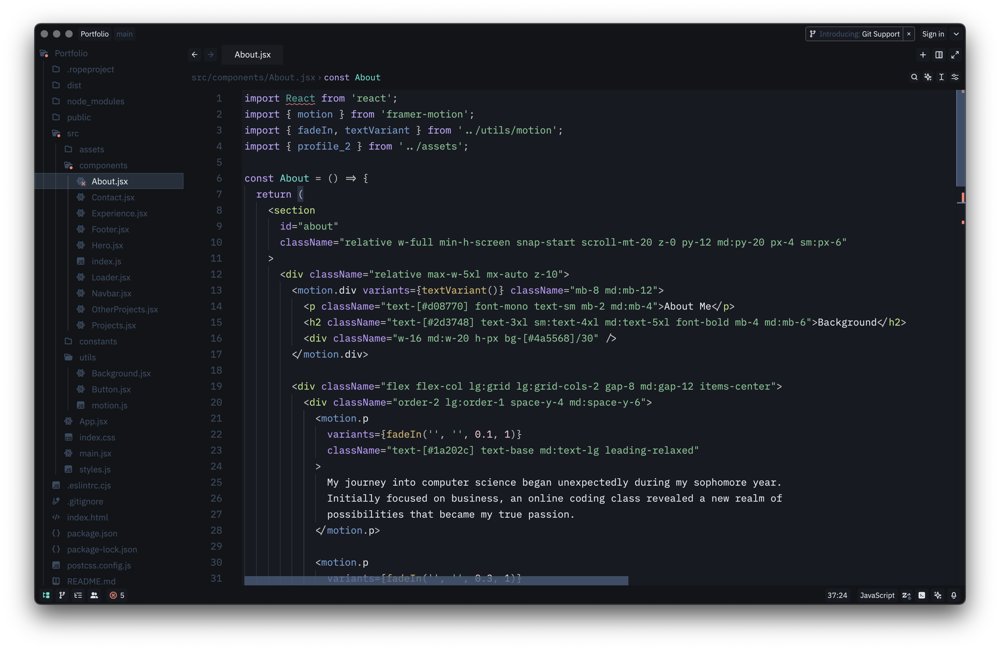

<p align="center">
  
</p>
<h1 align="center">
  ❄️ Arctic Depth Theme for Zed
</h1>
<p align="center">
  A sleek, high-contrast dark blue theme designed for developers who love rich blues and a futuristic aesthetic. It combines deep oceanic tones with crisp Arctic highlights to create a visually striking yet comfortable coding environment.
</p>



---

## ✨ Features

- 🎨 **Deep Blue Palette**: Carefully selected blues that reduce eye strain  
- 🔍 **High Contrast**: Clear distinction between syntax elements  
- 🧊 **Modern Aesthetic**: Clean, futuristic design with attention to detail  
- 💻 **Comprehensive Language Support**: Optimized for JavaScript, TypeScript, Python, HTML, CSS, and more  
- 🖥️ **Terminal Colors**: Custom ANSI color scheme that matches the theme  

---

## 📦 Installation

### **Method 1: Manual Install**
1. Download these files from the [latest release](https://github.com/MarvellinusVincent/Arctic-Depth/releases):
   - `themes/arctic-depth-color-theme-zed.json`
   - `package.json`
2. Copy them to Zed's themes folder:
   ```bash
   mkdir -p ~/.zed/themes
   cp themes/arctic-depth-color-theme-zed.json ~/.zed/themes/
   cp package.json ~/.zed/themes/
3. Restart Zed and select the theme.

### **Method 2: Clone Repository**
```bash
git clone https://github.com/MarvellinusVincent/Arctic-Depth-Zed.git ArcticDepthZed
cd ArcticDepthZed
mkdir -p ~/.zed/themes
cp themes/arctic-depth-color-theme-zed.json ~/.zed/themes/
cp package.json ~/.zed/themes/
```

---

## 🙌 Support

If you enjoy using **Arctic Depth**, consider supporting the project:

- ⭐ **Star** the repository to show your appreciation  
- 🐛 **Report bugs** or issues by opening a GitHub Issue  
- 💖 **Share** the theme with your developer friends  
- 📬 **Suggest features** or improvements — feedback is much appreciated!  

---

## 📄 License

This project is licensed under the terms of the [MIT License](./LICENSE.md).


